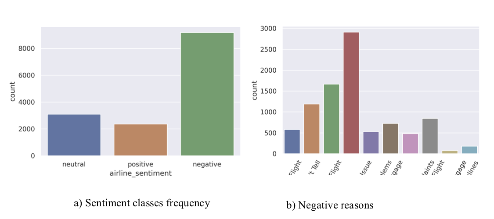
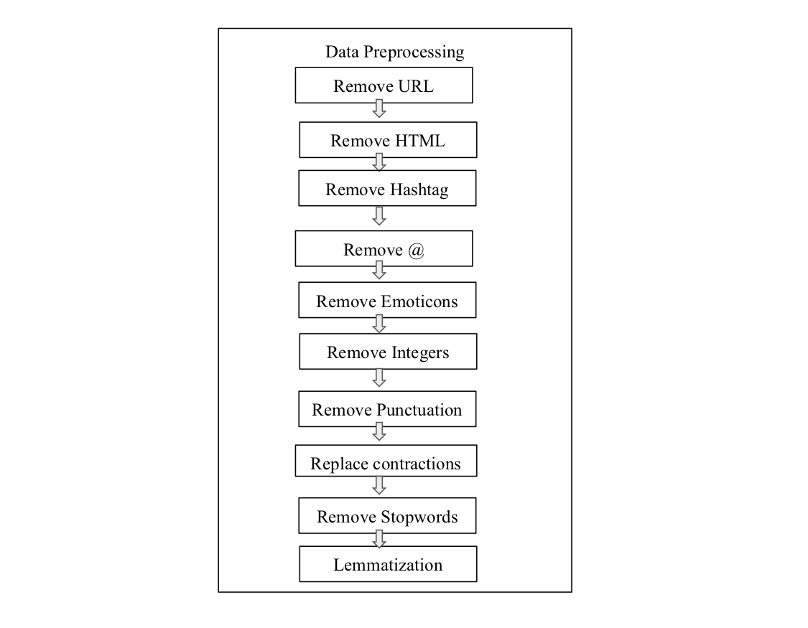

# Sentiment_Analysis_FellowshipAI
Sentiment analysis is a valuable technique in social media study as it provides us an overview of public opinions on certain topics. To extract such information, I apply a bi-directional LSTM-based model together with the use of squeeze and excitation module of Attention network. I have proposed a new loss function LSFLoss (Label Smoothing Focal Loss) to tackle with class imbalance issue and better model calibration. As the text embedding has been a big challenge in Natural Language Processing, the log-bilinear model GloVe is chosen in this paper due to less sparsity issues and computational cost. To do further experiment of self supervised learning, inspired by the Universal Language Model Fine Tuning (ULMFiT) technique, the model is trained with a sentiment analysis dataset first, then loaded to initialize parameters to train the Twitter US Airline Sentiment dataset. This method does not increase the accuracy and F1 score as expected but slightly decreases them.  
## Dataset 
The Twitter US Airline Sentiment dataset is provided in Kaggle, which is about people's comment on each major U.S. airline. The data was scraped from February of 2015 then categorized into positive, negative, and neutral tweets, followed by negative reasons, such as "cancelled flight" or "lost luggage". It includes 14640 samples in total, split into 0.8 and 0.2 for training and validation data. There are 15 features in the file, such as text, negative reason, name and tweet location, but only tweet id, airline sentiment and text will be chosen for the following analysis.  

### Data Preprocessing
As twitter messages do not require a fixed pattern or grammatical correction, people may use emoji, hashtags, repeated punctuation or abbreviations to express their feelings. However for the purpose of sentiment analysis, redundant parts are removed in the data cleansing process to transform the data into plain text. For word embedding, I apply GloVe as it is with less sparsity compared to Word2Vec.  

Here is the data preprocessing flow chart: 
</img> 

</img> 

## Proposed Method 
The model is bi-directional LSTM followed by two fully connected (FC) layers. I also integrate squeeze and excitation module [6] before each FC layer, which allows the network to perform feature recalibration,through which it can learn to use global information to se-lectively emphasise informative features and suppress lessuseful ones.  

## LSFLoss
Here I have proposed a new loss function LSFLoss (Label Smoothing Focal Loss) inspired by focal loss [4] and label smoothing [5]. As the dataset contains class imbalance problem, focal loss can tackle this problem. Label smoothing can improve the accuracy as well as model calibration.

## Result
Basic LSTM: Best_acc:78.9062, Best_F1:0.6321  
LSTM_ATTN: Best_acc:75.3906, Best_F1:0.7737 
RNN: Best_acc:78.2670, Best_F1:0.7117 
RCNN: Best_acc:78.7585, Best_F1:0.7083 
RNN_ATTENTION: Best_acc:78.6932, Best_F1:0.7152 
Proposed Architecture:Best_acc:79.0838, Best_F1:0.7716 

## Conclusion 
I use bi-directional LSTM with squeeze and excitation to predict sentiment of positive, negative and neutral from Twitter US Airline Sentiment dataset. I have proposed a new loss function inspired by focal loss [4] and label smoothing [5] to deal with class imbalance issue. The proposed model outperforms the recent sequential models like LSTM, RNN and RCNN. ULMFiT technique is also integrated with the proposed model, which does not increase the accuracy. Further experiment will focus on Language Modeling with Self Supervised Learning (SSL) scheme. 

## References
[1]Alexandra Chronopoulou, Aikaterini Margatina, Christos Baziotis, and Alexandros Potamianos. Ntua-slp at iest2018: Ensemble of neural transfer methods for implicit emotion classification.arXiv preprint arXiv:1809.00717,2018 
[2]Jeremy Howard and Sebastian Ruder. Universal language model fine-tuning for text classification.arXiv preprintarXiv:1801.06146, 2018. 
[3]Shervin Minaee, Elham Azimi, and AmirAli Abdolrashidi. Deep-sentiment: Sentiment analysis using ensemble ofcnn and bi-lstm models.arXiv preprint arXiv:1904.04206, 2019. 
[4]Tsung-Yi Lin, Priya Goyal, Ross Girshick, Kaiming He, and Piotr Dollár. Focal loss for dense object detection. InProceedings of the IEEE international conference on computer vision, pages 2980–2988, 2017. 
[5]Rafael Müller, Simon Kornblith, and Geoffrey E Hinton. When does label smoothing help?  InAdvances in NeuralInformation Processing Systems, pages 4694–4703, 2019.
[6]Hu, J., Shen, L., & Sun, G. (2018). Squeeze-and-excitation networks. In Proceedings of the IEEE conference on computer vision and pattern recognition (pp. 7132-7141).
